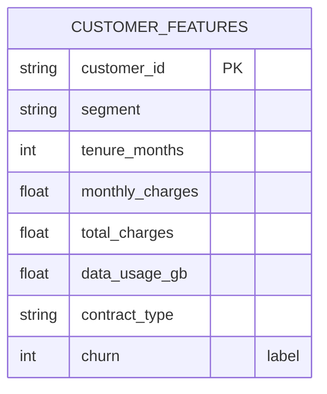
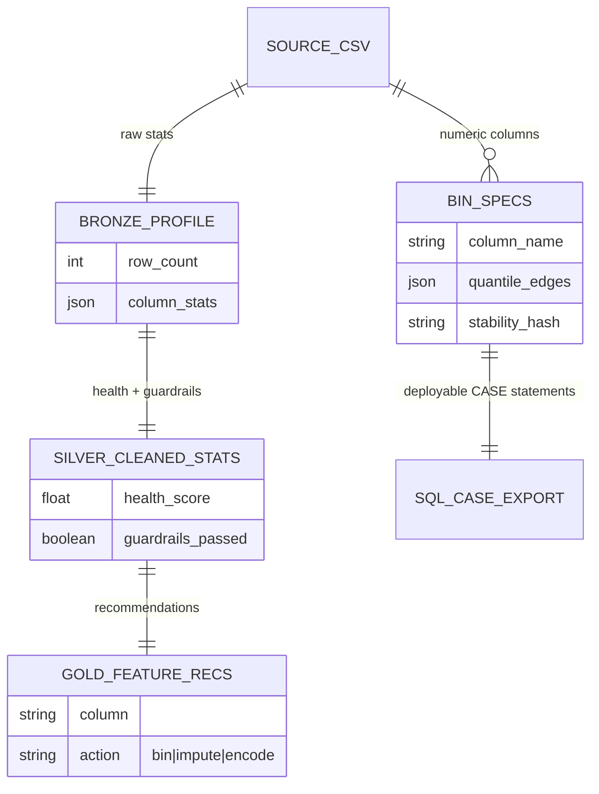
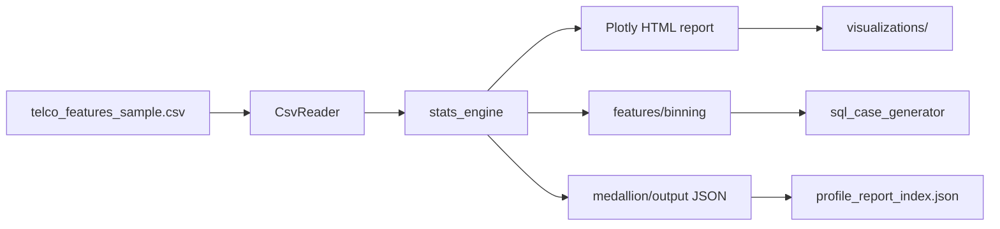

# Data Model & ERD — Python Auto Data Profiling

Feature-engineering profiler: source CSV → stats → bins → SQL CASE export.

Inspired by [R-Auto-Data-Profiling](https://github.com/rao-anas-riaz/R-Auto-Data-Profiling); diagram style reference: [uber-data-engineering-mage-project](https://github.com/darshilparmar/uber-data-engineering-mage-project).

Cross-reference: [data-dictionary.md](../../data-dictionary.md) · [DESIGN.md](../DESIGN.md)

---

## 1. Source sample ERD

Synthetic telco-style feature table (`telco_features_sample.csv`).

**Grain:** one row = one customer feature vector for profiling / binning.

---

## 2. Profiling output model

---

## 3. Pipeline lineage

